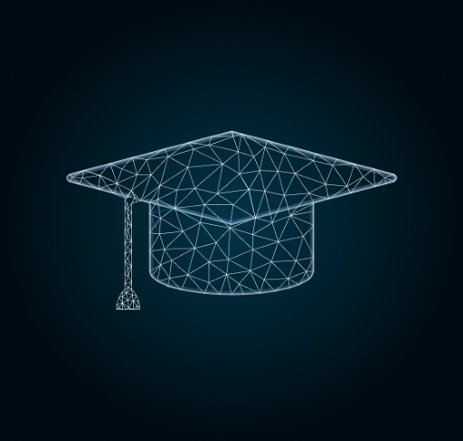

#  [Kyivstar-BigDataSchool5.0](https://bigdata.kyivstar.ua/school/)

* СУБОТА, 24 ЖОВТНЯ
> 12:00–13:00 Андрій Желєзняк, Олег Волошко, Ірина Віткова
>Welcome Speech and Data Science in Kyivstar

> 13:00–14:00 Валентин Кропов
> Essential Data engineering for Data Scientist – an open door to the unknown

>14:00–16:00 Олександра Клевець
>Introduction to Big Data – Theory

* ПОНЕДІЛОК, 26 ЖОВТНЯ
>19:00–21:00 Євген Полоничко
>Introduction to Azure platform

* СЕРЕДА, 28 ЖОВТНЯ
>19:00–21:00 Євген Полоничко Store data in Azure

* ПОНЕДІЛОК, 2 ЛИСТОПАДА
> 19:00–21:00 Євген Полоничко Azure Databricks & SQL Data Warehouse

* СЕРЕДА, 4 ЛИСТОПАДА
> 19:00–21:00 Євген Полоничко Data ingestion with Azure Databricks (ETL) – Part 1

* СУБОТА, 7 ЛИСТОПАДА
> 12:00–14:00 Євген Полоничко Data ingestion with Azure Databricks (ETL) – Part 2

> 14:00–16:00 Олександр Саєнко Data engineering with Azure Databricks (Data Frame)

* ПОНЕДІЛОК, 9 ЛИСТОПАДА
 > 19:00–21:00 Олександр Саєнко Data engineering with Azure Databricks – (Data Frame operation)

* СЕРЕДА, 11 ЛИСТОПАДА
> 19:00–21:00 Олександр Гурбич Machine Learning Algorithms – Theory. Supervised learning. Gradient Descent, Linear regression, Logistic regression, SVM, Decision trees, Feature Selection and generalization

* ПОНЕДІЛОК, 16 ЛИСТОПАДА
> 19:00–21:00 Олександр Гурбич Machine Learning Algorithms – Theory. Unsupervised Learning: Clustering, Dimensionality Reduction. Anomaly Detection, Recommender Systems

* СЕРЕДА, 18 ЛИСТОПАДА
> 19:00–21:00 Олександр Краковецький ML & Azure – Practice – Part 1

* СУБОТА, 21 ЛИСТОПАДА
> 12:00–16:00 Олександр Краковецький ML & Azure – Practice – Part 2

* ПОНЕДІЛОК, 23 ЛИСТОПАДА
> 19:00–21:00 Олександр Гурбич Deep Learning. Neural Networks

* СЕРЕДА, 25 ЛИСТОПАДА
> 19:00–21:00 Олександр Гурбич Deep Learning. Natural Language Processing – Theory

* ПОНЕДІЛОК, 30 ЛИСТОПАДА
> 19:00–21:00 Олександр Гурбич Deep Learning. Natural Language Processing – Practice

* СЕРЕДА, 2 ГРУДНЯ
> 19:00–21:00 Олександр Гурбич Deep Learning. Computer Vision: Image transformations, Homography estimation, Detectors and descriptors, Convolutional neural networks – Part 1

* ПОНЕДІЛОК, 7 ГРУДНЯ
> 19:00–21:00 Олександр Гурбич Deep Learning. Computer Vision: Image transformations, Homography estimation, Detectors and descriptors, Convolutional neural networks – Part 2

* СЕРЕДА, 9 ГРУДНЯ
> 19:00–21:00 Олександр Краковецький Deep Learning. Azure Cognitive Services

* СУБОТА, 12 ГРУДНЯ
> 12:00–16:00 Антон Ватов, Андрій Виходцев, Ігор Руденок Deployment and DevOps

* СУБОТА, 19 ГРУДНЯ
> 12:00–18:00 Course project. Graduation
